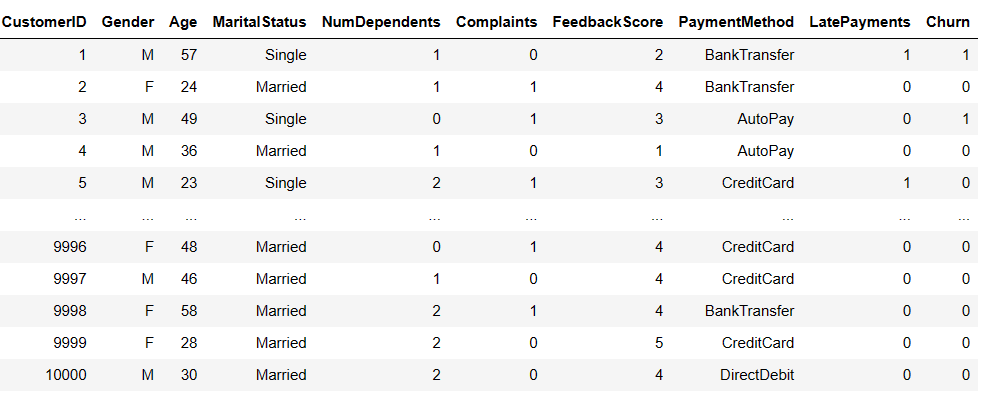
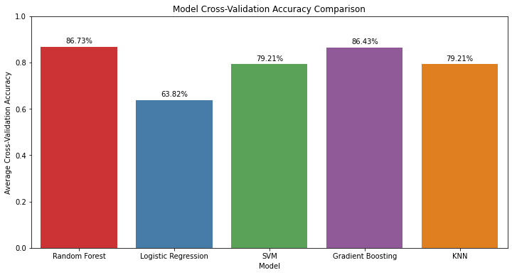

**Objective:**
The primary objective of this project is to predict customer churn, aiding businesses in proactively retaining customers. The project uses a structured dataset containing various customer features, and the target variable is binary, indicating whether a customer has churned (1) or not (0).

**Dataset:**
The generated dataset includes various features that might influence the likelihood of churn. Here's a description of the dataset:

1. **Customer Information:**
   - **CustomerID:** Unique identifier for each customer.
   - **Gender:** Gender of the customer (M or F).
   - **Age:** Age of the customer, randomly generated between 18 and 60.
   - **MaritalStatus:** Marital status of the customer (Single or Married).
   - **NumDependents:** Number of dependents the customer has (randomly generated between 0 and 3).

2. **Service and Billing Information:**
   - **PlanType:** Type of plan subscribed by the customer (Prepaid or Postpaid).
   - **ContractDuration:** Duration of the contract (6, 12, or 24 months).
   - **MonthlyCharges:** Monthly charges for the service.
   - **TotalCharges:** Total charges incurred by the customer.
   - **TotalCalls:** Total number of calls made by the customer.
   - **TotalSMS:** Total number of SMS messages sent by the customer.
   - **DataUsage:** Amount of data used by the customer.
   - **CustomerServiceCalls:** Number of customer service calls made by the customer.
   - **Complaints:** Indicates whether the customer has made complaints (0 or 1).
   - **FeedbackScore:** Feedback score provided by the customer (randomly generated between 1 and 5).

3. **Billing and Payment Information:**
   - **PaymentMethod:** Payment method used by the customer (AutoPay, CreditCard, DirectDebit, BankTransfer).
   - **LatePayments:** Indicates whether the customer has made late payments (0 or 1).

4. **Target Variable:**
   - **Churn:** Binary variable indicating customer churn (0 for no churn, 1 for churn). Churn is randomly assigned with a higher probability for non-churn (80% probability for 0 and 20% probability for 1).

This synthetic dataset aims to simulate a scenario where customer features are generated randomly, including factors that may contribute to customer churn. It provides a basis for building and testing customer churn prediction models. 

<span style="font-size: 8pt;">*Note: [Synthetic Data (First and last few features are shown above]*</span>

**Models Used:**
1. **Random Forest Classifier:**
   - A versatile ensemble learning method that builds multiple decision trees and merges their predictions to improve accuracy and robustness.

2. **Logistic Regression:**
   - A simple yet effective linear model used for binary classification tasks. It models the probability of an instance belonging to a particular class.

3. **Support Vector Machine (SVM):**
   - A powerful algorithm for both classification and regression tasks. SVM aims to find the hyperplane that best separates the classes in the feature space.

4. **Gradient Boosting Classifier:**
   - An ensemble learning method that builds a sequence of weak learners (usually decision trees) and combines their predictions to create a strong learner.

5. **k-Nearest Neighbors (KNN):**
   - A non-parametric classification algorithm that assigns an instance to the class most common among its k nearest neighbors in the feature space.
   - 
***Code Snippnet showing model parameter setting***
```python
# Model list with models and their hyperparameter grids
models = {
    'Random Forest': (RandomForestClassifier(),
                      {'n_estimators': [50, 100, 200],
                       'max_depth': [None, 10, 20, 30],
                       'min_samples_split': [2, 5, 10],
                       'min_samples_leaf': [1, 2, 4]}),
    
    'Logistic Regression': (LogisticRegression(),
                            {'C': [0.001, 0.01, 0.1, 1, 10, 100]}),
    
    'SVM': (SVC(),
            {'C': [0.1, 1, 10],
             'kernel': ['linear', 'rbf']}),

    'Gradient Boosting': (GradientBoostingClassifier(),
                          {'n_estimators': [50, 100, 200],
                           'learning_rate': [0.01, 0.1, 0.2],
                           'max_depth': [3, 4, 5]}),

    'KNN': (KNeighborsClassifier(),
            {'n_neighbors': [3, 5, 7],
             'weights': ['uniform', 'distance'],
             'p': [1, 2]}),
}

```
***Code Snippnet showing model execution***

```python
for model_name, (model, param_grid) in models.items():
    # Hyperparameter tuning using Grid Search
    grid_search = GridSearchCV(model, param_grid, cv=5, scoring='accuracy', n_jobs=-1)
    grid_search.fit(X_train, y_train)
    
    # Best model after hyperparameter tuning
    best_model = grid_search.best_estimator_
    
    # Cross-validation scores
    cv_scores = cross_val_score(best_model, X_train, y_train, cv=5, scoring='accuracy')
    accuracy = np.mean(cv_scores)
    accuracies.append(accuracy)
    model_names.append(model_name)

    print(f"\nModel: {model_name}")
    print("Best Hyperparameters:", grid_search.best_params_)
    print("Cross-Validation Scores:", cv_scores)
    print("Average Cross-Validation Accuracy:", accuracy)
    
    # Fit the best model on the entire training set for later evaluation
    best_model.fit(X_train, y_train)
    
    # Evaluate on the test set
    y_pred = best_model.predict(X_test)
    print("Test Set Accuracy:", accuracy_score(y_test, y_pred))
    print("Confusion Matrix:\n", confusion_matrix(y_test, y_pred))
    print("Classification Report:\n", classification_report(y_test, y_pred))
```
**Models Results:**

| Model                 | Best Hyperparameters                                      | Cross-Validation Accuracy | Test Set Accuracy | Precision (Class 0) | Recall (Class 1) |
|-----------------------|-----------------------------------------------------------|----------------------------|-------------------|---------------------|------------------|
| Random Forest         | {'max_depth': 30, 'min_samples_leaf': 1, 'min_samples_split': 2, 'n_estimators': 200} | 86.73%                    | 78.95%            | 79%                 | 0%               |
| Logistic Regression   | {'C': 0.001}                                              | 63.82%                    | 59.25%            | 80%                 | 42%              |
| SVM                   | {'C': 10, 'kernel': 'rbf'}                                | 79.21%                    | 69.65%            | 80%                 | 21%              |
| Gradient Boosting     | {'learning_rate': 0.1, 'max_depth': 3, 'n_estimators': 100} | 86.43%                    | 78.9%             | 79%                 | 0%               |
| KNN                   | {'n_neighbors': 3, 'p': 1, 'weights': 'distance'}          | 79.21%                    | 61.4%             | 80%                 | 35%              |

- The "Recall (Class 1)" column, the values are presented in percentage format. Additionally, precision and recall for Class 1 are provided, but the recall values for Class 1 in some models still seem low, indicating challenges in identifying the minority class despite applying SMOTE. Adjustments to the model or further tuning may be considered.

***Models Accuracy:***



Let's analyze the results for each model:

**1. Random Forest:**
   - **Performance:**
     - The model achieved a high cross-validation accuracy of 86.73%.
     - Test set accuracy is 78.95%, indicating reasonable generalization.
   - **Precision and Recall:**
     - Precision for class 0 (no churn) is high (79%), suggesting reliable identification of non-churning customers.
     - Recall for class 1 (churn) is low (0%), indicating challenges in identifying customers who actually churn.
     - F1-score for class 1 is 0, reflecting the imbalance in class distribution.

**2. Logistic Regression:**
   - **Performance:**
     - The model had a lower cross-validation accuracy of 63.82%.
     - Test set accuracy is 59.25%, suggesting moderate generalization.
   - **Precision and Recall:**
     - Precision for class 0 is 80%, indicating accurate identification of non-churning customers.
     - Recall for class 1 is 42%, suggesting some ability to identify customers who actually churn.
     - The F1-score for class 1 is 30%, reflecting a trade-off between precision and recall.

**3. SVM:**
   - **Performance:**
     - The model achieved a cross-validation accuracy of 79.21%.
     - Test set accuracy is 69.65%, indicating moderate generalization.
   - **Precision and Recall:**
     - Precision for class 0 is 80%, indicating accurate identification of non-churning customers.
     - Recall for class 1 is 21%, suggesting challenges in identifying customers who actually churn.
     - The F1-score for class 1 is 23%, indicating a trade-off between precision and recall.

**4. Gradient Boosting:**
   - **Performance:**
     - The model achieved a high cross-validation accuracy of 86.43%.
     - Test set accuracy is 78.9%, indicating reasonable generalization.
   - **Precision and Recall:**
     - Precision for class 0 is 79%, indicating accurate identification of non-churning customers.
     - Recall for class 1 is 0%, indicating challenges in identifying customers who actually churn.
     - The F1-score for class 1 is 0, reflecting the imbalance in class distribution.

**5. KNN:**
   - **Performance:**
     - The model achieved a cross-validation accuracy of 79.21%.
     - Test set accuracy is 61.4%, indicating moderate generalization.
   - **Precision and Recall:**
     - Precision for class 0 is 80%, indicating accurate identification of non-churning customers.
     - Recall for class 1 is 35%, suggesting some ability to identify customers who actually churn.
     - The F1-score for class 1 is 28%, reflecting a trade-off between precision and recall.

**Overall Summary:**
- Random Forest and Gradient Boosting exhibit high cross-validation accuracy but struggle with recall for class 1, indicating challenges in identifying customers who churn.
- Logistic Regression and SVM provide a balance between precision and recall, with SVM showing better performance in recall for class 1.
- KNN demonstrates moderate generalization with a balance between precision and recall.

**Note:**
These observations highlight the trade-offs between precision and recall, especially in the context of imbalanced datasets. Further tuning and evaluation metrics may be considered depending on the specific business objectives and consequences of false positives/negatives.
